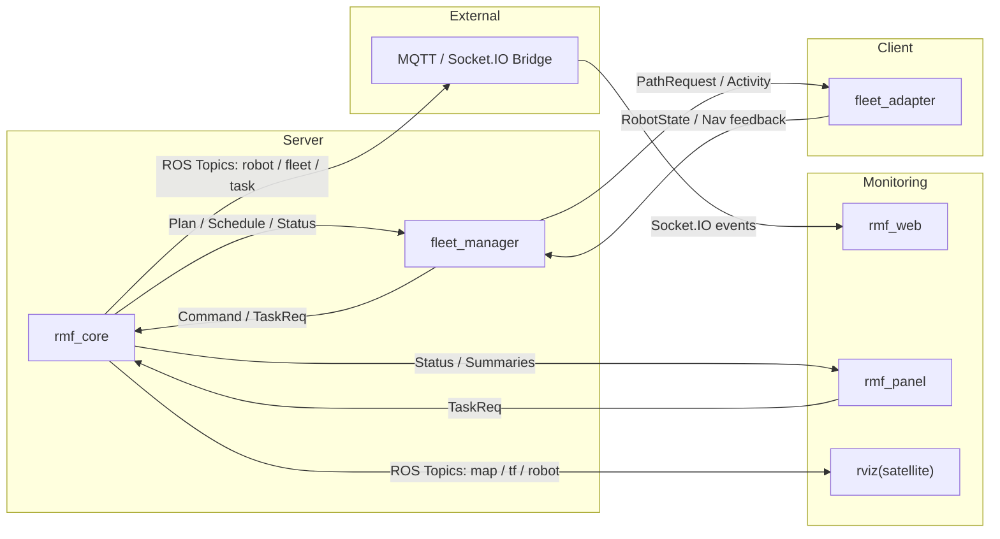

# RMF Robot Client (Fleet Adapter & FSM)

본 저장소는 **Open-RMF 기반 다중 로봇 관제 시스템**에서 **로봇(Client)** 측 코드를 담당하는 패키지 모음입니다.  

- **역할**: RMF Server가 내려주는 작업/경로를 수신하여 FSM을 통해 Nav2 주행 스택으로 실행  
- **구성**: 로봇 어댑터(Fleet Adapter), 상태 기계(FSM), 주행 스택(Navigation2 Stack), 외부 브릿지(MQTT/Socket.IO), Docker 환경  
- **활용**: 실외 배달로봇 다중 운영 및 관제 시스템에 적용  

---

## 📌 1. 필요하게 된 상황
실외 환경에서 다수의 배달로봇을 운행하려면, 각 로봇이 단독으로 주행만 할 수 있어서는 부족합니다.  
- 중앙 관제(RMF Server)와 로봇 간 **작업/상태 교환**이 필요  
- 보행자, 차량, 날씨 등으로 인한 장애물 등장과 위험 지역 등 **실외 주행 제약 조건** 존재

---

## 🔧 2. 시스템 구성
로봇단(Client)에서는 다음과 같은 구성 요소로 동작합니다:

- **로봇 어댑터 (`fleet_adapter`)**  
  - RMF Server가 내려주는 작업/경로(PathRequest)을 Nav2 명령으로 변환  
  - 로봇 상태(RobotState)를 주기적으로 RMF Server에 보고  

- **상태 기계 (`fsm_waypoint_node`)**  
  - Nav2 태스크의 상위 제어(실행·취소·재시작)  
  - Nav2가 제공하는 피드백을 바탕으로 안정적인 주행 사이클 유지  
  - 문제 상황 발생 시 정지, 상황 해소 시 재주행 관리
  - 주행/악세서리 텔레메트리 데이터 발행  

- **주행 스택 (`navigation2_stack`)**  
  - 로봇 주행의 핵심 엔진 (경로 계획·추종·복구)  
  - 실외 환경에 맞게 커스텀  
    - Planner: **StraightLine** (직선 경로 최적화)
    - Controller: **RotationShim + Regulated Pure Pursuit**  
    - Behavior Tree: `navigate_to_pose_w_replanning_and_recovery.xml` (Stop & Go 로직)

- **외부 브릿지 (`rmf_demos_bridges`)**  
  - MQTT/Socket.IO를 통한 클라우드 및 외부 모니터링 연계  
  - 텔레메트리 데이터를 외부 시스템에 전달  

- **원격 제어 (WebSocket 기반)**  
  - WSS(WebSocket Secure)를 통해 외부에서 제어 명령 수신  

- **Docker 환경**  
  - 전체 시스템을 컨테이너로 패키징하여 손쉽게 실행·배포 가능

---

## 🔀 3. 시스템 아키텍처 & 데이터 흐름


---

## 🚀 4. RMF Robot 실행 가이드  

본 문서는 **로봇단(Client) 코드**를 Docker Compose 기반으로 실행하기 위한 절차를 설명합니다.  

`sim`, `nav2`, `fsm` 세 가지 서비스를 중심으로 빌드 및 실행 과정을 따라 하면 됩니다.

---

### 🧱 (1) 이미지 빌드

먼저 컨테이너 이미지를 빌드합니다.  

서비스별로 나눠 빌드할 수 있으며, 최초 1회만 실행하면 됩니다.

```bash
docker compose build iron    # ROS 2 Iron / Nav2 기반 이미지
docker compose build rmf     # RMF(sim 등) 관련 이미지
```

---

### ▶️ (2) 환경 준비

- **X11 표시 권한 부여**  

GUI 또는 시뮬레이터 실행 시 호스트의 X 서버 접근을 허용해야 합니다.  

리눅스 환경에서 다음 명령어를 실행합니다.  

```bash
xhost +    # 보안을 고려한다면: xhost +local:
```

- **.env 파일 생성 및 작성**  

컨테이너 실행에 필요한 환경변수를 `.env` 파일로 관리합니다.  

리포지토리 루트 디렉토리에서 다음 명령어로 `.env` 파일을 생성합니다.  

```bash
touch .env
# Example
ROS_DOMAIN_ID=123
DISPLAY=0
CONFIG_FILE=/root/ws/src/rmf_demos/config/office/tinyRobot_with_nav2_config.yaml  # ← 중요: 실제 환경에 맞게 수정
```

- **모델 리소스 배치**  

시뮬레이터 실행 시 필요한 모델 리소스를 프로젝트 루트에 배치해야 합니다.  

전달받은 `models.tar.gz` 파일을 `Open-RMF_DeliveryRobot` 루트 폴더에 위치시킵니다.  

---

### 🚀 (3) 실행

필요한 서비스만 지정하여 실행할 수 있습니다.  

여기서는 `sim`, `nav2`, `fsm` 세 서비스를 함께 실행합니다.  

```bash
# 포그라운드 실행 (로그를 바로 확인 가능)
docker compose up sim nav2 fsm

# 백그라운드 실행 (로그는 별도로 확인)
docker compose up -d sim nav2 fsm
```